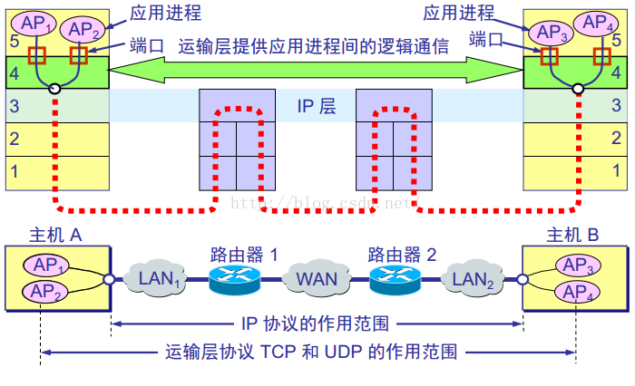
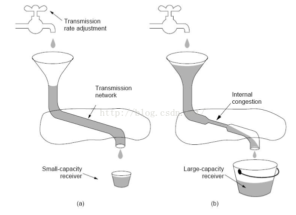
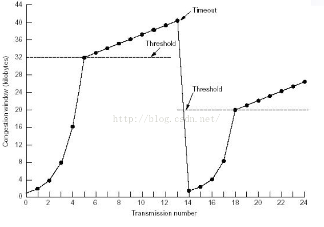

>  	如图：TCP和UDP作用在运输层，他们将应用层传递下来的数据按照TCP、UDP自己的协议格式封装起来，再传给网络层，由网络层的IP协议封装成IP数据报的形式，然后通过网络、路由器转发等操作再传输到另一台通信主机，主机收到数据后解封装，并交给传输层处理，传输层再解封装交给应用层处理。传输层只是对应用层的数据进行了一下处理，加一点东西，打包自己的格式的数据。就好像应用层给传输层一个苹果，传输层把它包在了一个特定的盒子里，盒子上写着一些信息，然后再交给下层网络层。

> ​	举一个例子表达TCP和IP的关系：TCP就好像一家公司的经理，他想要和另一家公司的经理交流一下想法，于是他理了一下思路，给另一家公司的经理写了一封信，不要问我为什么不直接打电话，因为当时没有电话。这封信就可以认为是TCP协议封装好的数据报。然后该经理将这封信放到公司邮箱，快递员拿到信后根据上边写的IP地址（*端口号+IP地址：端口号表明是哪个经理写的信，一个公司可能有很多经理，对应到计算机中就是哪个程序进程； IP地址就是IP协议中的地址，告诉快递员要送到哪*）决定要送到哪个地方，至于怎么送，就是IP协议的事了，肯定是查路由表，转发到下一个路由器，再查该路由器的路由表，继续转发，最终到达另一个公司。该公司的前台根据端口号决定要把这封信交给哪个经理，然后经理取完信后再处理他跟发信经理的爱恨情仇。

> 当然，这个例子还可以继续举下去，公司的老板就相当于应用层，老板会把他的指示告诉某一个专管某件事的经理，然后该经理再按照指示写信，给另一家公司。然后那家公司对应的经理收到信后再向自己的老板，也就是应用层汇报。比如QQ就处在应用层，你跟其他人聊天的时候，QQ就把聊天数据传给下层一个专门负责通信的进程（*可以理解为已经到了传输层*），该进程收到数据后再按照TCP或UDP的协议格式加一点东西包装一下，继续往下层网络层交付，然后经过路由发送到对方主机，对方主机根据端口号再把它交给QQ通信的进程，该进程再拆掉一些包装，然后交给QQ，这样你发送的数据就显示在了别人的手机上。

​	TCP最大的特点就是面向连接，稳定可靠，全双工（全双工就是A可以给B发消息，同时B也可以给A发，就像我们打电话一样）。面向连接的话肯定就有两个过程：建立连接（通过三次握手），拆除连接（无论多少次握手都无法确保正确拆除：两军对垒难题）

稳定可靠就是差错控制，流量控制和拥塞控制。

+ 差错控制：一般使用，超时重传机制，加入发送方没有收到接收方关于正确接收的回复，在等了一个特定的时间段后就会认为发送失败了，然后重新发送。因为IP协议只是提供了一种尽力而为的传输，也就是说他并不保证数据一定正确传输过去，所以需要传输层来进行差错控制。就好像快递员也有可能把快递弄丢一样，如果这家公司的经理很久都没有收到对方的回复，那他肯定。。。

+ 流量控制：我们总希望数据发送的足够快，但是发送方发的足够快，接收方并不一定可以接收这么快，因为有很多别的主机，别的进程也给他发送数据，他不一定能够一下子处理，有可能缓存空间不一定够用了，这时候就需要用流量控制了。当接收方感觉缓存受不鸟的时候就给发送方传输一个数据，来告诉发送方，我的接受窗口是**（如200），然后发送方就把自己的发送窗口设置为200。有可能他之前的发送窗口是1000，设置成200后，发送数据相对以前更慢了一些，接收方就来得及接收。（关于滑动窗口的概念可以参考go-back-nARQ协议，滑动窗口越大，可以认为传输速度越快）

+ 拥塞控制：拥塞控制是TCP非常非常重要的一个性质。拥塞的意思就是对某一网络资源的占用超过了了该资源的所能提供的能力，网络的性能就会变坏。就好像街道上堵车一样，来的车太多了，车道不够用，大家就会挤在一起，数据发出去很慢。衡量拥塞的一个常用指标就是吞吐量。

  

> 如图，右（b）图网络中间产生了拥塞，这样就很影响网络吞吐量，解决拥塞通常的方法还是限制发送方发速率。常用的方法是慢启动和拥塞避免：

> 比如刚开始拥塞窗口设置为32，发送窗口设置为1，然后发送窗口指数增加：2,4,8,16…32，显然，这时候发送速度也在增加，达到拥塞窗口32后，发送窗口开始线性增加——每次增加1，在达到40的时候，突然发生了拥塞，这时候发送窗口立即减为1，拥塞窗口变为40/2=20.然后发送窗口继续指数增加1,2,4,8,16…在达到20的时候，又开始线性增加。。。，如此循环。通俗来说就是先给一个数据发送速率门限，然后发送方一直快速提高自己的发送速率，达到门限后，就感觉可能要发生拥塞了，所以开始缓慢增加发送速率。发生拥塞后，将门限设置为现在窗口的一半，再继续循环这个过程。

==总结==：传输层就实现了端到端之间（应用进程到应用进程之间，经理到经历之间）的数据传输控制。只要是数据传输，就有可能会出错，会阻塞，会溢出（接收方的缓存就像是一个桶，倒的水太快，就会溢出，也就是数据会丢失），所以传输层的TCP协议要解决差错控制，流量控制和拥塞控制，目的就是让数据快速，正确的传送到目的端。

#### 参考文章

+ [传输层、TCP协议的通俗解释](https://blog.csdn.net/char_xidian/article/details/53119052)
+ [TCP/IP详解 卷1：协议](http://www.52im.net/topic-tcpipvol1.html)

